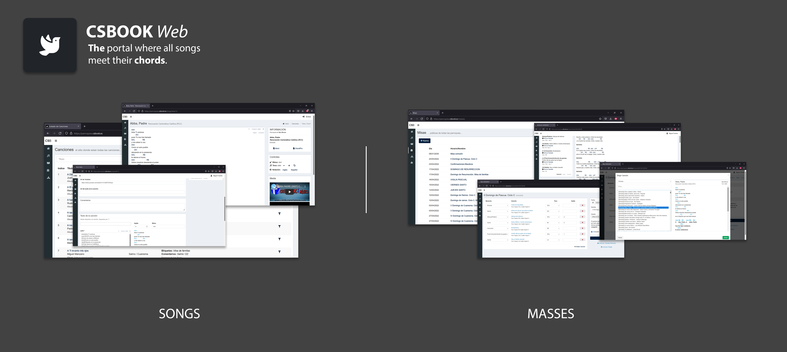

PHP/Symfony web app in where to store, manage and view the songs with chords for the sunday service or for any other catholic celebration. 

## Features
There are 3 important sections to this application, songs, masses and songbooks. The idea started 4 years ago when the need for a new songbook arised in our community. Willing to do make it perfect, we exceeded our expectation and not only we did a word auto-generated songbook but also a platform where to manage songs, masses and songbooks.

This sections are:
- **Songs**: You have the ability to create and edit songs, with their chords, a youtube video, and mp3 public file link, description etc. Not only this, but in the view page for a song you can change the tone of the song (upping and downing the chords), the notation (english or spanish), and also download the file in _**word**_ format or in _**crd**_ format.
- **Masses**: You have the ability to create and edit masses, adjusting the tone for that specific mass. In the mass view page, you have also the ability to change the notation and to download the _**word**_ and _**ppt**_. The _**ppt**_ format is just a help, a styling work is needed with the raw downloaded file.
- **Songbooks**: The system can provide you with a doc file with a set of songs. Again a styling work may be needed. Once the document is approved for release, a public _url_ can be provided and stored int he system. Also a manual work is offered to enter the index of every song so that can be displayed on the mass view page.
